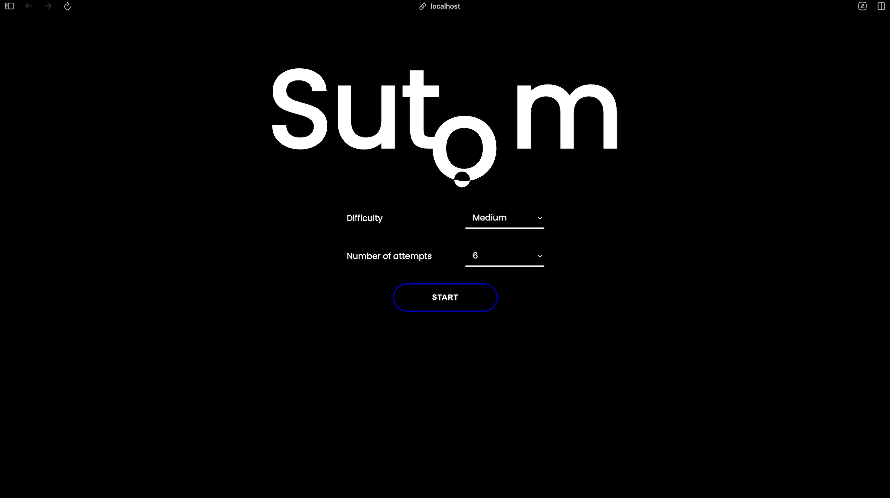

# Project : SUTOM



## Subject
The goal of the project is to reproduce the game [Motus](https://fr.wikipedia.org/wiki/Motus_(jeu_t%C3%A9l%C3%A9vis%C3%A9)) (Sutom in reverse).

## Prerequisites
Make sure you have Docker installed on your machine before running the project.

## Run the project

> ⚠️ Ensure your Docker daemon is running on your machine.

In your terminal, navigate to the project directory:

```cd SutomForNeoFacto```

Then, start the project using Docker Compose:

```docker compose up```


Finally, open your browser and go to [http://localhost:80](http://localhost:80) to access the game.

## Technologies
The backend was built with Java Spring Boot.
The frontend was created with Angular.
